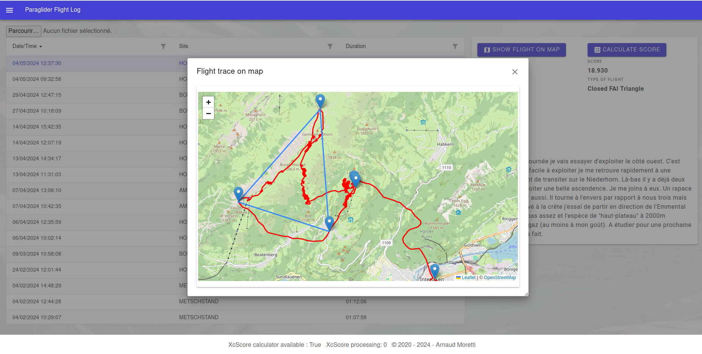
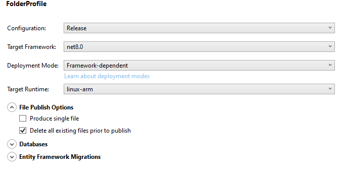
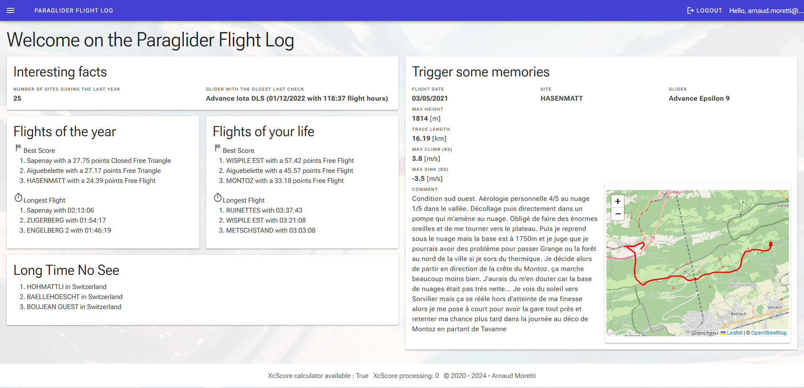
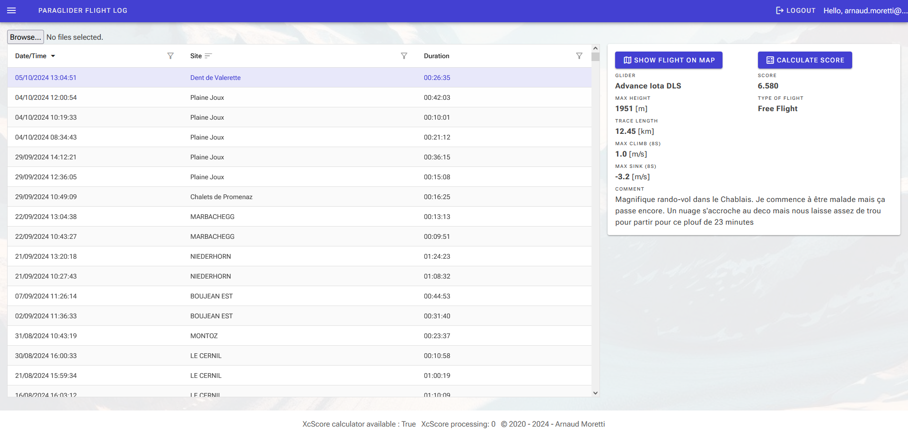
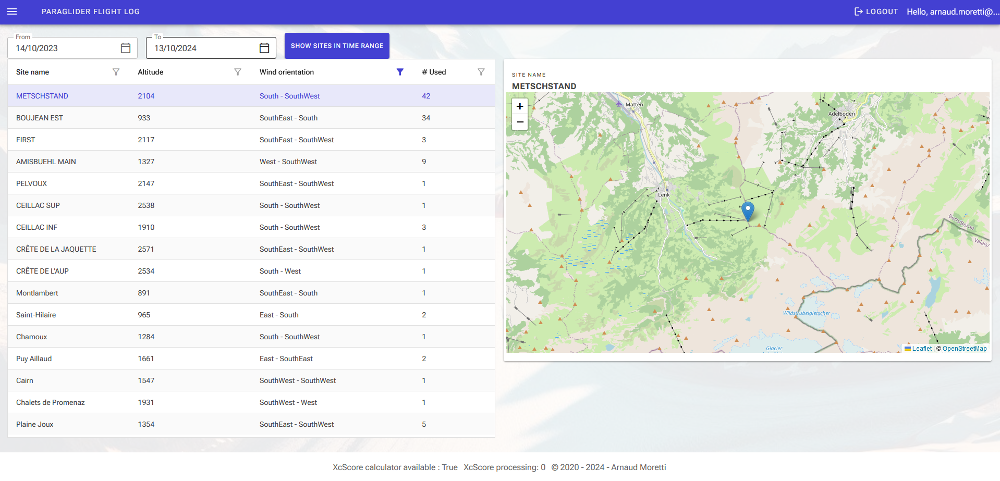
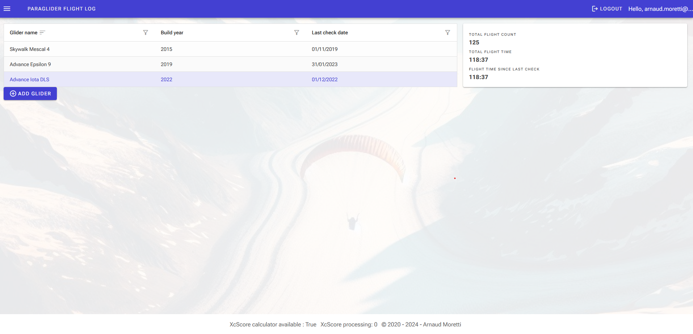
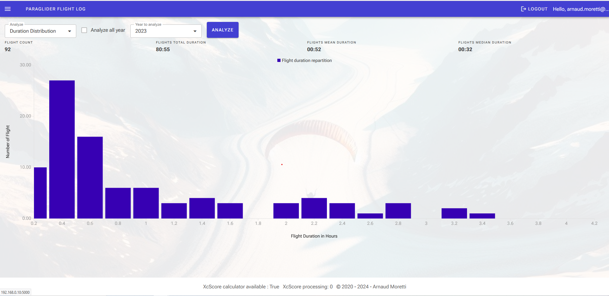
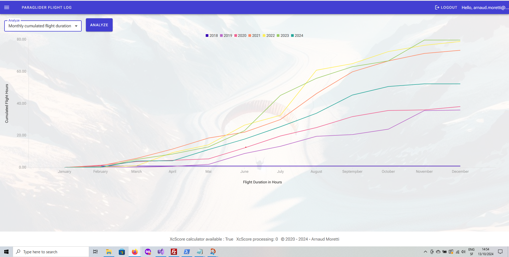
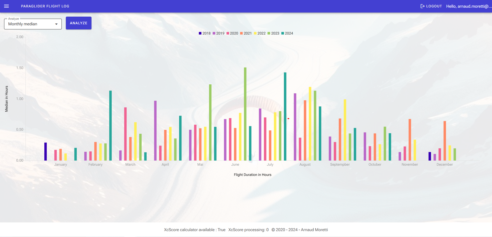

# Paraglider Flight Log

Paraglider Flight Log  allows to keep track of the flight of several paraglider pilots along with the flying site and the gear that each pilot used. A pilot can use this application to easily log, comment, analyse his flights without relying on remote services. It computes several statistic and can optionnaly work together with the application igc-xc-score (https://github.com/mmomtchev/igc-xc-score) from mmomtchev (https://github.com/mmomtchev) that can be installed separately.



## Technologies used

* C#
* .Net 8
* Blazor Web App
* Radzen
* Sqlite
* MS Identity
* Leaflet
* Javascript

## Installation
This project has not any automatic installation process (yet...). Here is a quick overview of the steps needed to make it run. I could add an automatic installation process if there is some shown interests (Feel free to create an issue if so).

The app needs a working .Net8 runtime

* Modify the existing appsettings.json or add an appsettings.Production.json with the path you want to use to run the app
* Publish the app using the specification you need.
 I use and test this project on a raspberry pi 3. The publish settings are as follow for this architecture

* Move the resulting file to the location of your choice
* Run the app by executing `./ParaglidingFlightLogWeb`
* Use a Web Browser to access the app. It should be available on http://localhost:5000 if you run it on the same computer you use to access it.

Optionaly you can install Node in order to run an instance of igc-xc-score available here (https://github.com/mmomtchev/igc-xc-score) and complete the corresponding settings in the appsettings.json file

To make the app start at boot on a linux with systemd enabled, you can take the following steps:

* Save this script somewhere and replace the part between <> by the specific detail of your installation
```
#!/bin/bash
export DOTNET_ROOT=<Path to your donet folder>
export PATH=$PATH:<Path to your donet folder>

echo "Starting PargligliderFlightLog"
cd <Path to your app installation> 
./ParaglidingFlightLogWeb &

```

* Create a service using the procedure here (https://linuxhandbook.com/create-systemd-services/) as an inspiration.

## Using the app

### Identification
To use the app you must be logged. The app use Identity Framework by Microsoft with individual account to identify user.

Sevreral user can use the app to manage their own flights.

If you are not logged the app will show you this screen.


You can click on `Log In` or use the left navigation menu to register and log in.
For now the email confirmation is not implemented since the app is intended for local use only. (Feel free to add an issue on this sibject if there is an insterest)
!!! The app use http so the data will not be encripted. This is ok for trusty local network use but certainly not to be use on WWW.!!!
### Dashboard

Once logged you are welcomed with a Dashboard



On the right part you will find a randomly chosen flight from your collection. The flight is pick from the subset of the flight done on the same day of other year or from the flight that have been filled with comments.
On the left part you have several other information:
	
* The number of different site you used in the last year
* The next glider you should send to check
* A score board with your best flights of the year and a global score board
* A list of known sites that you haven't visited for a while

### Flights list

Using the left navigation menu you can access the list of your flights. You can use the button `Browse` to add some flights by uploading an IGC file. The IGC file is the main standard accross paragliding instrument.
By doing so the IGC file is parsed to extract the flight points coordinates, the glider name (if present), the take off location and other data as shown on the example image.

If an installation of `igc.xc.score` (https://github.com/mmomtchev/igc-xc-score) is available the score of the flight will be add.

When you click on a flight, its information are displayed on the right (or bellow the grid if you are on a small screen). From this information card you can add photos and create a sharable copy of the flight

By right clicking on a flight you can remove it or change its details.

### Sites list

Using the left navigation menu you can access a list with all the sites detected as take off point where they can be named and fill with other usefull detail. All subsequent flight that have their take off point in the same area of a already existing Site will have their take off associated with this site.
The table on the left show the list of the flights. When clicking on a site, it will be shown on the map on the right. By right clicking on a site you can change its details (location, name, town, orientation, etc).
The upper button allows to show all the site used in a certain time range to have a general view.
### Gliders list

Using the left navigation menu you can access the list of your gliders. The flights are analyzed to display the number of flight and the flight hours done with each of them (globaly and from the last check).
By right clicking on a glider, you can edit some details like the last check date, its name, or its reference name (The name your instrument uses to name it)

### Flight Statistic



Using the left navigation menu you can access some statistic about your flights. The available statistic are the following:

* Distribution of the flight duration (on one year or globaly)
* Median of the flight duration over each month (every year on the same graph using a color by year)
* Average of the flight duration over each month (every year on the same graph using a color by year)
* Cumulated flight duration over each month (every year on the same graph using a color by year)
* Score for each year on 4 ,6, 10 and 20 flights

## Upcoming changes
* See Feature request in Issue or add yours
