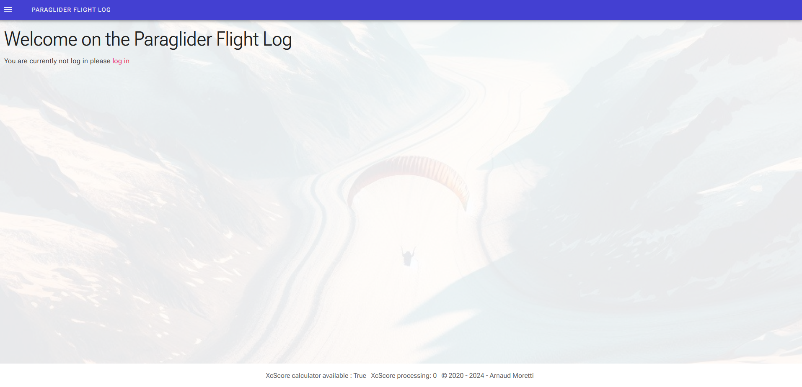

# Paraglider Flight Log

Paraglider Flight Log allows you to keep track of the flights of several paraglider pilots along with the flying site and the gear that each pilot used. A pilot can use this application to easily log, comment, and analyze their flights without relying on remote services. It computes several statistics and can optionally work together with the application igc-xc-score (https://github.com/mmomtchev/igc-xc-score) from mmomtchev (https://github.com/mmomtchev) that can be installed separately.


## Technologies used

* C#
* .Net 8
* Blazor Web App
* Radzen
* Sqlite
* MS Identity
* Leaflet
* Javascript

## Installation

> **?? Security Notice:**
> Paraglider Flight Log runs over HTTP by default and does not provide built-in SSL/TLS encryption.
> - For local or trusted network use, this is generally safe.
> - For public or internet-facing deployments, you **must** use a reverse proxy (e.g., Nginx, Apache, Caddy) to enable HTTPS and secure user data.
> - Never expose the app directly to the internet without SSL/TLS.

### Docker Installation (Recommended)

The easiest way to run Paraglider Flight Log is using the official Docker image published on GitHub Container Registry (GHCR).

#### Prerequisites
- Docker Engine 20.10+ and Docker Compose 2.0+

#### Quick Start
1. **Clone the repository** (for configuration and docker-compose):
   ```sh
   git clone https://github.com/noar12/ParagliderFlightLog.git
   cd ParagliderFlightLog
   ```
2. **Create and customize your `.env` file** (optional):
   ```sh
   cp .env.example .env
   # Edit .env as needed
   ```
3. **Start the application using Docker Compose:**
   ```sh
   docker-compose up -d
   ```
   This will pull the latest image from GHCR and start the app.

4. **Access the app:**
   - Open your browser at [http://localhost:5001](http://localhost:5001)
   - Change the port in `docker-compose.yml` if needed

#### Data Migration (if upgrading from manual install)
If you have existing data (e.g., from `/home/webapp/ParagliderFlightLogDb`), use the provided migration script:
```sh
chmod +x migrate-to-docker.sh
./migrate-to-docker.sh /home/webapp/ParagliderFlightLogDb
```
This will copy your database and user photos into the correct Docker volume.

#### Updating
To update to a new version:
```sh
git pull
# (or update your docker-compose.yml to use a new image tag)
docker-compose pull
# Restart the app
docker-compose up -d
```

---

### Manual Installation (Legacy)

This method is for advanced users or those who cannot use Docker.

The app needs a working .Net8 runtime.

* Modify the existing appsettings.json or add an appsettings.Production.json with the path you want to use to run the app
* Publish the app using the specification you need.
  I use and test this project on a raspberry pi 3. The publish settings are as follow for this architecture
  
* Move the resulting file to the location of your choice
* Run the app by executing `./ParaglidingFlightLogWeb`
* Use a Web Browser to access the app. It should be available on http://localhost:5000 if you run it on the same computer you use to access it.

Optionally you can install Node in order to run an instance of igc-xc-score available here (https://github.com/mmomtchev/igc-xc-score) and complete the corresponding settings in the appsettings.json file

To make the app start at boot on a linux with systemd enabled, you can take the following steps:

* Save this script somewhere and replace the part between <> by the specific detail of your installation
```
#!/bin/bash
export DOTNET_ROOT=<Path to your donet folder>
export PATH=$PATH:<Path to your donet folder>

echo "Starting PargligliderFlightLog"
cd <Path to your app installation> 
./ParaglidingFlightLogWeb &
```
* Create a service using the procedure here (https://linuxhandbook.com/create-systemd-services/) as an inspiration.

---

## Using the app

### Identification
To use the app you must be logged in. The app uses Identity Framework by Microsoft with individual account to identify users.

Several users can use the app to manage their own flights.

If you are not logged in the app will show you this screen.



You can click on `Log In` or use the left navigation menu to register and log in.


### Dashboard

Once logged you are welcomed with a Dashboard


On the right part you will find a randomly chosen flight from your collection. The flight is picked from the subset of the flights done on the same day of other years or from the flights that have been filled with comments.
On the left part you have several other information:

* The number of different sites you used in the last year
* The next glider you should send to check
* A score board with your best flights of the year and a global score board
* A list of known sites that you haven't visited for a while

### Flights list

Using the left navigation menu you can access the list of your flights. You can use the button `Browse` to add some flights by uploading an IGC file. The IGC file is the main standard across paragliding instruments.
By doing so the IGC file is parsed to extract the flight points coordinates, the glider name (if present), the take off location and other data as shown on the example image.

If an installation of `igc.xc.score` (https://github.com/mmomtchev/igc-xc-score) is available the score of the flight will be added.

When you click on a flight, its information is displayed on the right (or below the grid if you are on a small screen). From this information card you can add photos and create a sharable copy of the flight

By right clicking on a flight you can remove it or change its details.

### Sites list

Using the left navigation menu you can access a list with all the sites detected as take off point where they can be named and filled with other useful details. All subsequent flights that have their take off point in the same area of an already existing Site will have their take off associated with this site.
The table on the left shows the list of the flights. When clicking on a site, it will be shown on the map on the right. By right clicking on a site you can change its details (location, name, town, orientation, etc).
The upper button allows to show all the sites used in a certain time range to have a general view.

### Gliders list

Using the left navigation menu you can access the list of your gliders. The flights are analyzed to display the number of flights and the flight hours done with each of them (globally and from the last check).
By right clicking on a glider, you can edit some details like the last check date, its name, or its reference name (The name your instrument uses to name it)

### Flight Statistic


Using the left navigation menu you can access some statistics about your flights. The available statistics are the following:

* Distribution of the flight duration (on one year or globally)
* Median of the flight duration over each month (every year on the same graph using a color by year)
* Average of the flight duration over each month (every year on the same graph using a color by year)
* Cumulated flight duration over each month (every year on the same graph using a color by year)
* Score for each year on 4, 6, 10 and 20 flights

## Upcoming changes
* See Feature request in Issue or add yours
